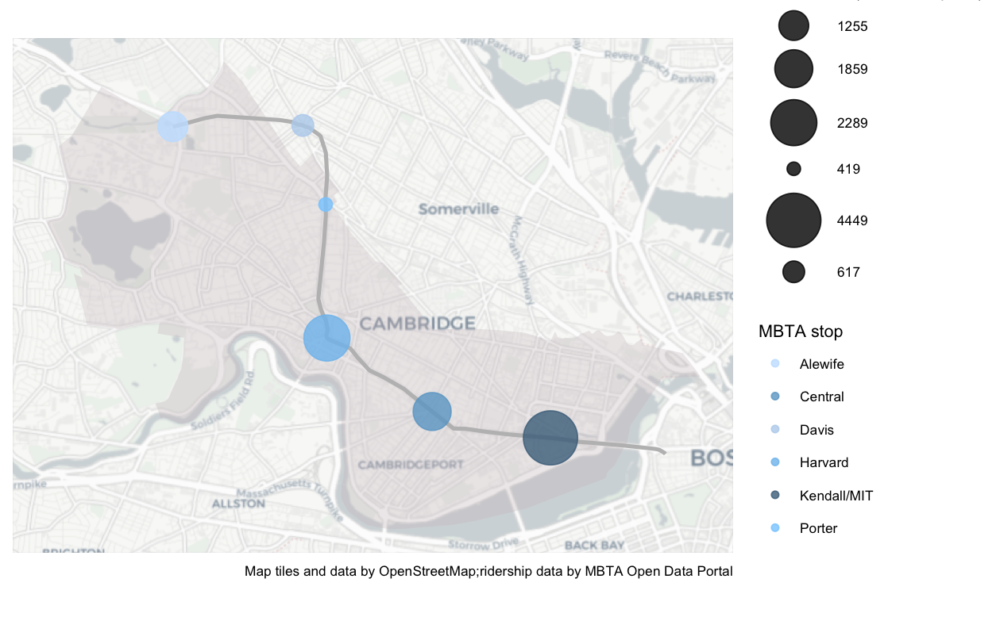
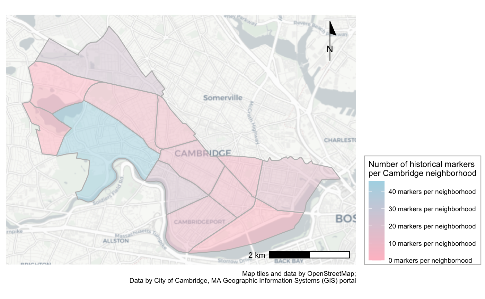
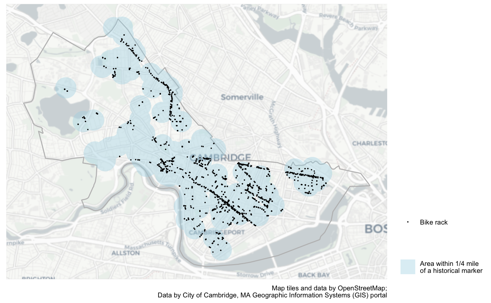
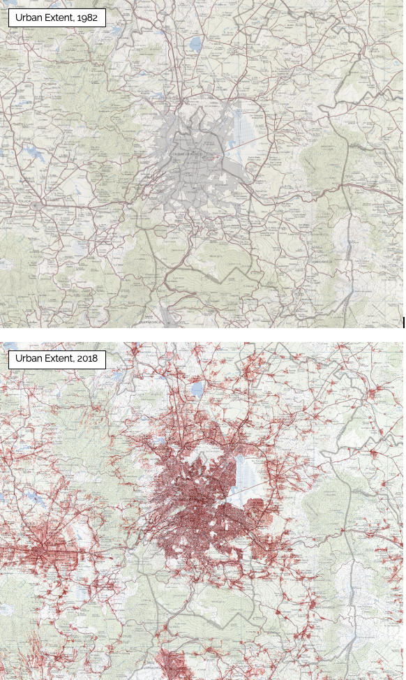
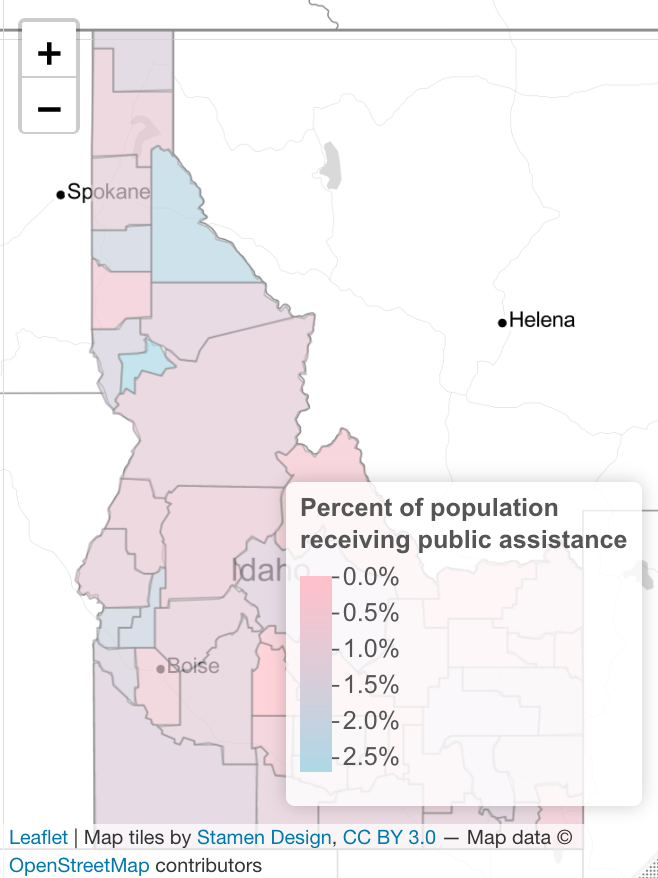

```{r setup, include=FALSE}
knitr::opts_chunk$set(echo = TRUE)
```

# Introduction
This portfolio demonstrates spatial analysis and data mapping skills developed through coursework in the urban planning department at the Harvard Graduate School of Design. The below maps were produced for the course "2128: Spatial Analysis" with Professor Carole Voulgaris. While much of the work for the course was completed in groups, all of the below maps are my own. Please feel free to contact me at arawlings[at]gsd[dot]harvard[dot]edu with any questions or to discuss future opportunities for collaboration.

Using R and ArcGIS, the following maps demonstrate the below spatial analysis proficiencies:

* Displaying multiple vector layers on the same map

* Calculating and displaying relationships among point and polygon layers based on distance

* Aggregating point data to a layer of polygons

* Calculating and displaying accessibility, based on travel time

* Converting between raster layers and vector layers

* Displaying raster data on a map

* Georeferencing a raster image

* Displaying data on an interactive map

# Displaying Spatial Data- Cambridge, MA

## MBTA Ridership
This map displays the number of Massachusetts Bay Transportation Authority (MBTA) rapid transit users who exit from each MBTA station during the morning commuter peak (7am to 9am). This map limits data analysis to the red line-- the public transit line that serves Cambridge, MA.
[](https://arawlings1.github.io/portfolio/fullsize/cambridge_mbta.pdf){target="_blank"}

## Historical Markers
This map displays the neighborhoods of Cambridge, MA by the number of officially-registered historical markers contained within them. The data was accessed through the City of Cambridge's GIS portal.
[](https://arawlings1.github.io/portfolio/fullsize/cambridge_historicalmarkers.pdf){target="_blank"}

## Bike Racks x Historical Markers
Building on the previous map, this map identifies the regions of the city within a 1/4 mile (reasonable walking distance) of a historical marker and the number of bike racks within each region. In aggregate there are 598 bike racks located within a 1/4 mile of a historical marker in Cambridge.
[](https://arawlings1.github.io/portfolio/fullsize/cambridge_bikeracks.pdf){target="_blank"}

# Displaying Historical Data- Mexico City, MEX
## Urban extent, from 1982 to 2018
These two maps compare a historical map of the urban extend of Mexico City in 1982, shown in grey, and the urban extent as measured through population density in 2018, shown in red. The historical (1982) map was accessed through Harvard University's map collection, then manually georeferenced using ArcGIS. Modern data on population density (2018) was accessed through the "Humanitarian Data Exchange," then overlaid on top of the 1982 historical map.
[](https://arawlings1.github.io/portfolio/fullsize/mex_urbanextent.pdf){target="_blank"}

# Transportation Networks- Portland, OR

## Walking x Grocery Stores
## Transit x Farmer's Markets
## Walking x Food x Access

# Interactive Maps- Idaho, USA

## Public Assistance Receipt
This interactive map displays the estimated number of individuals per year receiving some form of income through a public assistance program across Idaho counties. Data for this map comes from the 2013-2017 American Community Survey (ACS) 5-Year Estimates. Click into the map to explore.
[](https://arawlings1.github.io/portfolio/fullsize/id_pubassistance.html){target="_blank"}